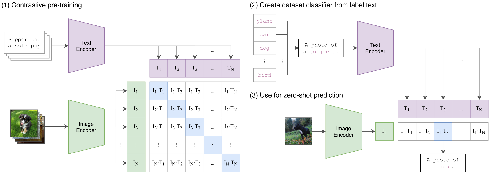

### Disclaimer
This is my first ever post, please excuse any inaccuracies. Any suggestions welcome at strakammm@gmail.com!

## Motivation
Ever since Deep Learning started as a field, we have been observing an increased performance of models coming
from using bigger datasets and more compute. One such compute and data demanding architecture, [Transformer](https://arxiv.org/abs/1706.03762),
is used in many State-of-the-Art methods. The architecture properties and recent [scaling laws](https://arxiv.org/abs/2001.08361) indicate that
leveraging large amounts of data should lead to increased performance.

However, the problem with datasets such as [ImageNet](https://arxiv.org/abs/1409.0575) is that they grow slowly and have a weak annotation 
(usually just one word). On the other hand, websites such as Wikipedia or Instagram, contain bilions of images that
contain some richer annotation in form of captions. [CLIP](https://arxiv.org/abs/2103.00020) leverages these large 'annotated' datasets to train large
vision and language transformers in a fashion from which interesting properties emerge.

### Shared Latent Space
The first interesting property is that CLIP doesn't just learn arbitrary representations of text and images,
but it embeds them into the same latent space. This basically means that when we get vector representation from CLIP
for text and for image, we can compute the similarity between using cosine similarity. This enables us to use CLIP
for text-image retrieval or text conditioning in image generation or image segmentation.

### Zero-Shot Transfer
The second crucial property of CLIP is that it unlocks zero-shot transfer. In practice, instead of encoding image classes
as one-hot vectors, we can encode them simply as 'strings'. Then, since CLIP text encoder can encode any text, it can
therefore encode any label we want. This allows us to use CLIP on our custom labels without any transfer learning.
See code down below.

## Method

### Pre-Training
The training procedure for the CLIP method is very sim-
ilar to traditional supervised training.
The dataset consists of 400 milion image-text pairs
scraped from the internet. The architecture leverages one
encoder for text and one for images. After obtaining a batch
of N image-text pairs, we obtain embeddings from respective encoders.
These representations are projected by one
more linear layer into the same latent space where they are
$L_2$ normalized. From these normalized representations an
$N × N$ similarity matrix is created by computing pair-wise
dot-product between every image and text representation.
Then the softmax operation is applied to every row and col-
umn, creating probability distributions - for each image we
have distribution over all texts and symmetrically for each
text we have distribution over all images. Logits of ground
truth labels are conveniently on the diagonal of the similarity matrix,
from which we compute cross-entropy loss and train both encoders jointly.

### Downstream adaptation
On the right side of the image above we observe how such model
can be applied to downstream tasks. We create custom la-
bels as strings, encode them once and cache obtained rep-
resentations. Then, when a new image that has to be clas-
sified comes in, we obtain its representation and compare
it to cached text embeddings. Since text encoder can en-
code any string of characters to obtain its representation,
the zero-shot property emerges.

## Main Results
### Zero-Shot Transfer
Perhaps the most important result of the paper is about its
zero-shot performance. Authors stress the importance of
zero-shot evaluation as a way to assess true generalization
strength of Computer Vision models on unseen datasets and
motivate it as measuring task-learning capabilities. This is
important because true general models should not need to
be adapted to every new task they are presented with.
From the Fig. 2 we can see that CLIP is a very strong zero-shot
model, outperforming ResNet-50 on majority of datasets:

### Natural Distribution Shift
The study of generalization suggests another concept called
Natural Distribution Shift, which measures models’ ability
to classify images from the same class, but sampled from
a different distribution (dataset). Consider an example of a
banana. In one dataset, we might be presented with a photo
of a banana, but in another, there might be black and white
sketches of it. Humans understand the concept of a sketch
and therefore understand that it does not need to be yellow.
But do Computer Vision models understand it too? 

Authors show
that most Computer Vision models trained on ImageNet are weak
in this regard. CLIP, on the other hand, is able to maintain
its performance when presented with samples for various distributions,
which hints that it is indeed a very general model.

## Roll Your Own Classifier!

## Conclusion
In this short post we have motivated and desribed the CLIP method.
The CLIP method is a powerful tool for Computer Vision.
The ideas for pre-training show us how we can leverage vast amounts
of data that is freely available on the internet.
The zero-shot performance gives us a much more representative measure
of generality of Computer Vision models and Deep Learning practitioners
can leverage zero-shot for quickly evaluating new ideas.

## References

- [Attention is all you need](https://arxiv.org/abs/1706.03762)

- [Learning Transferable Visual Models From Natural Language Supervision](https://arxiv.org/abs/2103.00020)

- [Scaling Laws for Neural Language Models](https://arxiv.org/pdf/2001.08361)

- [ImageNet](https://arxiv.org/abs/1409.0575)